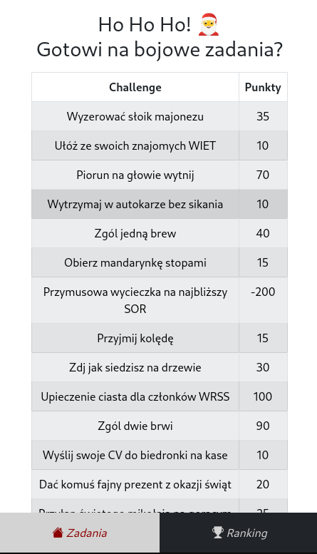
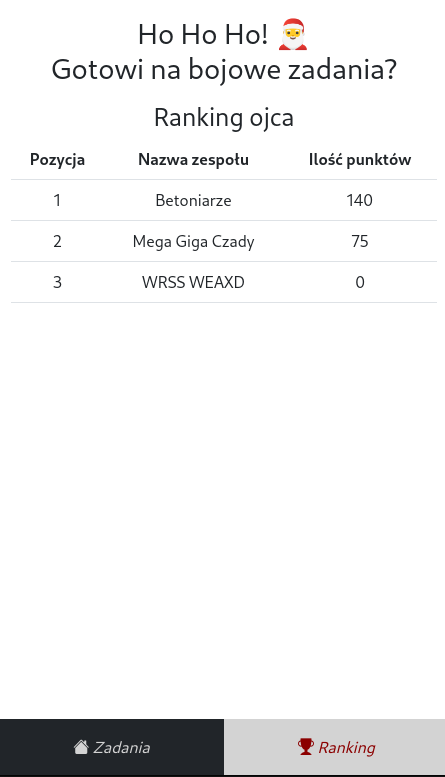
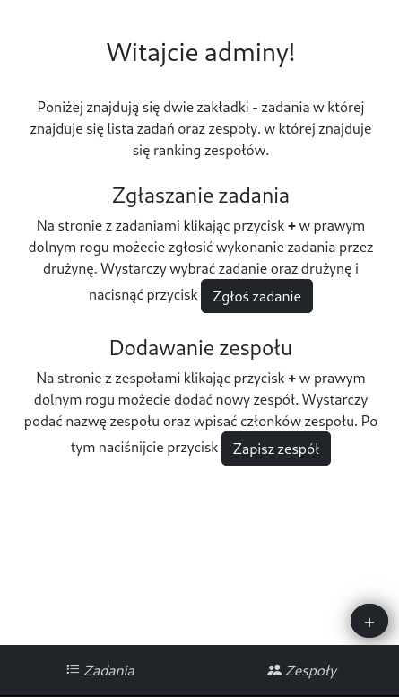

# ✨ Rajd Elektryka 2023 - challenges site

As a member of IT team at WRSS (Students' Council) I've developed a web app project for the Rajd Elektryka 2023. It's a site with challenges for the participants of the event. The site is written in React using TypeScript and Bootstrap. As a backend, it uses Firebase. It is accessible at [https://wrss-weaiiib-rajd23.web.app/](https://wrss-weaiiib-rajd23.web.app/).

## 📚 Main features

-   Challenge list
-   Live dashboard of teams
-   Admin login via Google account
-   Admin user authentication
-   Admin panel, where one can add a team and add points for task completion.

## 📷 Screenshots

  
   
  

## 🤓 What I've learned

It was my first so complex web project, developed in very little time (from 0 knowledge in React to deployment in less than two weeks). I've learned a lot about React, TypeScript, Firebase, but more importantly I've got to know how to build a web app from scratch. That gave me a lot of deeper understanding of web development. Also, such a project was fun to do. As in many web projects, there have been some unpleasant bugs, so my debbuging skills have elevated.
